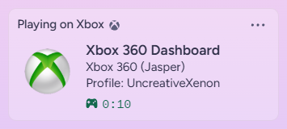
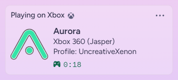
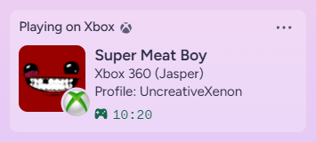
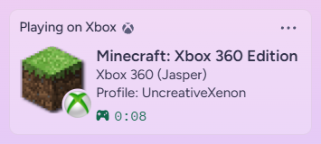
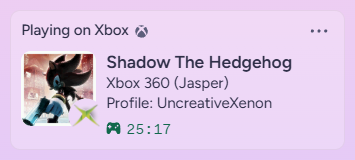
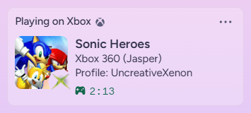
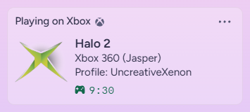
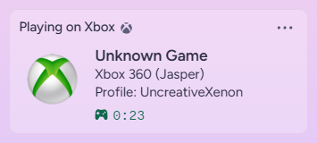
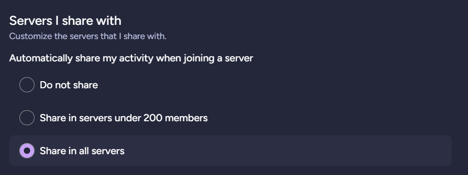

# XeCord

An **Xbox 360 Discord Rich Presence Plugin**.

> ⚙️ **Note:** Works only on **hacked Xbox 360 consoles**. If your console is not hacked, see [Related Projects](#-related-projects) for alternatives.
>
> 🎮 **Xbox Original Games Support:** Titles are supported but unlike 360 games, most lack assets and will display the default Xbox Original icon instead.
>
> Most images and assets are sourced from **[XboxUnity.net](https://xboxunity.net)**.

> ⚠️ Warning:
> This uses the **Discord User Gateway** and is therefore **against Discord’s Terms of Service**.  
> You may use this **at your own risk**.  
> That said, people have been using custom Direct User Gateway Rich Presences for **4–5 years** with no known cases of account termination.

## ✨ Features

- **Standalone Real-Time Updates:** Updates Discord Rich Presence automatically in real-time—no PC bridge or manual refreshing required.

- **Extensive Compatibility:** Supports a vast library of games out of the box.

- **Fully Customizable:** Tailor your presence to your preference. Choose a minimalist text-only look (similar to Xbox One/Series Activity) or a detailed display featuring game art, profile stats, and console information.

## 🔧 Setup

1. **Download** [Xbdm.xex](https://consolemods.org/wiki/File:Xbdm.xex) and add it as the **first plugin in `launch.ini`**.
2. **Download** the latest build from the [Releases](https://github.com/UncreativeXenon/XeCord/releases) section.
3. **Edit** `XeCord.ini` before moving it:
   - Add your **Discord User Token** to `XeCord.ini`.
   - Configure other options to your preference.
   - Save your changes.
4. **Place** `XeCord.ini` and `XeCordTitles.bin` in the same folder as `XeCord.xex`.
5. **Add** `XeCord.xex` to `launch.ini` plugin list.

## 🖼️ Screenshots

## 🛠️ Troubleshooting

- Q: **_"Some people cannot see my Activity although I can."_**\
  A: Make sure your Activity Privacy options are set to "Share in all servers".
  

## 🐞 Issues

- If you encounter issues, please open an issue with logs or reproduction steps.

## 🔗 Related Projects

If you’re interested in similar projects or supporting them, check these out:

- [Xbox-Rich-Presence-Discord](https://github.com/MrCoolAndroid/Xbox-Rich-Presence-Discord) by [MrCoolAndroid](https://github.com/MrCoolAndroid)
- [XboxUnity-Scraper](https://github.com/UncreativeXenon/XboxUnity-Scraper)

## 🤝 Contributions

- This is mostly a personal project, but contributions and suggestions are welcome.
- Feel free to fork and modify it as needed.

## 🙌 Thanks To

A big thank you to the following communities and resources for their contributions and support:

- [XexUtils](https://github.com/ClementDreptin/XexUtils) by [ClementDreptin](https://github.com/ClementDreptin)
- [Byrom](https://github.com/Byrom90) for mount paths (lol)
- [XboxTLS](https://github.com/JakobRangel/XboxTLS) by [JakobRangel](https://github.com/JakobRangel)
- [Xbox360Hub Discord #coding-corner](https://xbox360hub.com/)
